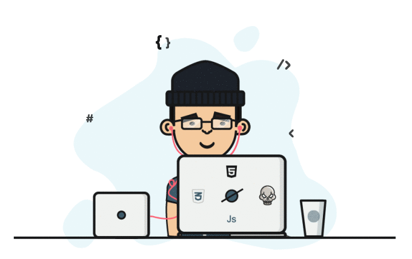

<h1 align="center">Hey 👋, I'm Atikur Rahman</h1>
<h3 align="center">🚀 Full Stack Developer | 🤖 AI/ML Enthusiast | 💻 Software Engineer | CSE Graduate from BRAC University</h3>

 

  

  <table>
    <tr>
      <td width="50%" valign="top">
      
        
## <picture></picture> **About me**

  

- 🎓 **B.Sc in Computer Science and Engineering** from [BRAC University](https://www.bracu.ac.bd/)

- 💼 **Full Stack Web Developer** with expertise in modern web technologies

- 🤖 **AI/ML Enthusiast** exploring the frontiers of artificial intelligence

- 🌱 Currently diving deep into **Machine Learning, Deep Learning & AI**

- 🔭 Open to collaborations in **Web Apps, AI/ML**

- 📧 Mail me: [khandakeratik43@gmail.com](mailto:khandakeratik43@gmail.com)

- 🌐 Portfolio: [<b>[Click here]</b>](https://khandaker-atik.vercel.app)

- 📃 Checkout my [<b>[Resume]</b>](https://atik-resume.vercel.app)

- ⚡ Fun fact: My first program wasn't even "Hello, World!" 😅

 

## <b> Skills & Expertise</b>

**💻 Programming Languages**

**🌐 Web Development**

**🚀 Frameworks & Libraries**

**🤖 AI/ML & Data Science**

**🗄️ Database & Cloud**

**🛠️ Tools & Version Control**

**💡 Core Concepts & Methodologies**

✅ Software Development Life Cycle (SDLC) | ✅ Object-Oriented Programming (OOP)  
✅ Database Design & Management | ✅ RESTful API Development  
✅ Machine Learning Algorithms | ✅ Web Security Best Practices

 

## <b> GitHub Statistics</b>

 

 

## 🤝 **Let's Connect**

 

### 🌟 "Code is like humor. When you have to explain it, it's bad." 🌟

  
